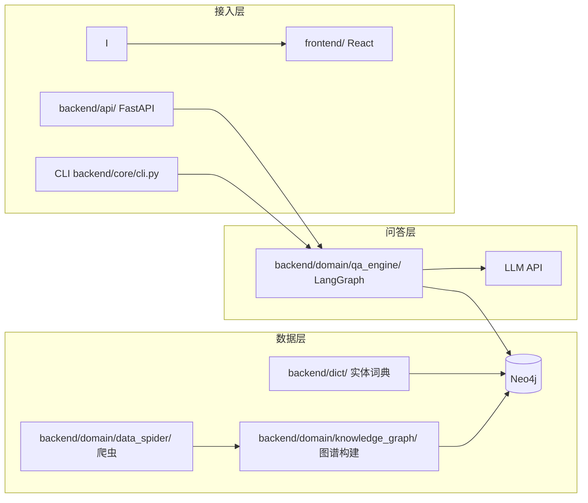
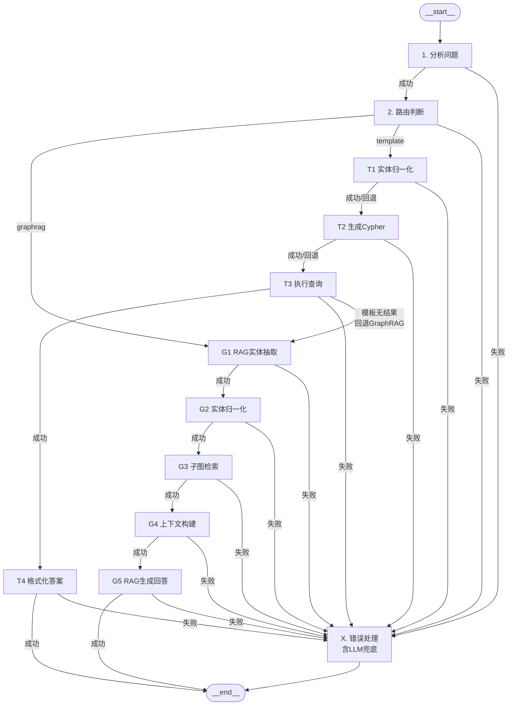

# 医药知识图谱智能问答系统

> v1.0.0 — 基于 LangGraph 的统一问答引擎

[Python](https://www.python.org/)
[LangChain](https://github.com/langchain-ai/langchain)
[LangGraph](https://github.com/langchain-ai/langgraph)
[Neo4j](https://neo4j.com/)
[FastAPI](https://fastapi.tiangolo.com/)
[React](https://react.dev/)

> 基于公开医药数据从零构建的医疗知识图谱问答系统，支持 KBQA 模板检索、GraphRAG 子图检索与 LLM 兜底三级降级路由。已采集 8700+ 疾病数据，覆盖症状/病因/饮食/检查等维度。提供 CLI、FastAPI 流式 API、React 前端三种使用方式。

---

## 核心特性

- **三级降级分析**：Level 1 全 LLM → Level 2 LLM 实体 + 关键词意图 → Level 3 离线词典 NER
- **条件路由**：简单问句走模板 Cypher 路径，复杂多实体问句自动切换 GraphRAG
- **SSE 流式输出**：答案逐字返回，`done` 事件携带 debug 与图谱数据
- **LangSmith 可观测**：可选开启链路追踪，记录路由、降级等级与子图统计
- **图谱可视化**：React 力导向图 + 节点点击展开邻居 + 侧边面板可拖拽调整宽度
- **统一前端面板**：`UnifiedChatPanel` 单入口，后端自动路由，无需手动切换模式
- **多轮对话**：LangGraph `MemorySaver` + `session_id`（CLI / Web / API 一致）
- **全路径图谱数据**：模板 Cypher 结果与 GraphRAG 子图均写入 `graph_data`
- **全链路智能兜底**：模板失败→自动回退 GraphRAG →仍不可用→LLM 直接回答→静态提示，前端清晰展示流转路径（如「模板检索 → GraphRAG → AI 回答」），用户永远不会收到冰冷提示

---

## 系统架构

### 数据全链路



### 问答工作流（qa_engine）



LangGraph 工作流

> 重新生成：`python backend/scripts/generate_diagrams.py`

---

## 快速开始

### 🐳 Docker 一键启动（推荐）

无需安装 Python、Neo4j、Node.js，只需 **Docker**：

```bash
git clone <your-repo-url>
cd MedicalGraphRAGSystem

# 1. 配置 API Key
cp .env.example .env        # Windows: copy .env.example .env
# 编辑 .env，填入 SiliconFlow API Key（注册: https://siliconflow.cn）

# 2. 一键启动（首次 5-10 分钟导入图谱，之后秒启）
docker compose up -d

# 3. 查看启动进度
docker compose logs -f

# 4. 浏览器打开
# http://localhost:8000
```

> 首次启动会自动下载镜像 + 导入 4.4 万实体数据，请耐心等待。  
> 详细运维命令与故障排查 → [docs/DOCKER.md](docs/DOCKER.md)

---

### 💻 本地开发启动（需要 Python / Neo4j / Node.js）

#### 环境要求

| 组件      | 版本建议                                     |
| ------- | ---------------------------------------- |
| Python  | 3.10+                                    |
| Neo4j   | 4.x / 5.x（已导入医疗图谱数据）                     |
| Node.js | 18+（仅前后端分离前端）                            |
| LLM     | Ollama 本地 / OpenAI 兼容 API（如 SiliconFlow） |

> ⚠️ **必须使用虚拟环境（venv）**。本项目依赖 LangChain 1.0 生态，与 0.x 不兼容。直接全局安装会导致依赖冲突并运行失败。

#### 1. 创建并激活虚拟环境

```bash
git clone <your-repo-url>
cd MedicalGraphRAGSystem

# 创建虚拟环境（仅首次）
python -m venv .venv

# 激活虚拟环境（每次开发前执行）
# Windows (PowerShell):
.venv\Scripts\activate
# Windows (CMD):
.venv\Scripts\activate.bat
# Linux / macOS:
source .venv/bin/activate

# 验证：确认 python 指向 .venv 中的解释器
# Windows: where python
# Linux/macOS: which python
```

#### 2. 安装依赖

```bash
# 确保已激活 venv（终端提示符前应有 (.venv)）
pip install backend/
```

#### 3. 配置文件

```bash
cp .env.example .env   # Windows: copy .env.example .env
```

编辑 `.env`，至少配置以下项：

```env
NEO4J_URI=bolt://127.0.0.1:7687   # 本地开发注意用 127.0.0.1
NEO4J_USER=neo4j
NEO4J_PASSWORD=your_password
LLM_PROVIDER=openai                # 或 ollama
OPENAI_API_KEY=sk-your-key-here
OPENAI_BASE_URL=https://api.siliconflow.cn/v1
LLM_MODEL=deepseek-ai/DeepSeek-V4-Pro
```

#### 4. 导入图谱数据（首次部署，耗时较长）

```bash
python -m backend.domain.knowledge_graph.main
```

可选参数：
```bash
python -m backend.domain.knowledge_graph.main --clear           # 先清空旧数据再导入
python -m backend.domain.knowledge_graph.main --step nodes      # 只创建节点
python -m backend.domain.knowledge_graph.main --step rels       # 只创建关系
```

#### 5. 启动

两种入口，任选其一：

| 入口         | 命令                                                                      | 适用场景            |
| ---------- | ----------------------------------------------------------------------- | --------------- |
| **CLI**    | `python -m backend.core.cli` 或 `python -m backend.core.cli --stream`                    | 终端调试、脚本集成       |
| **前后端分离**  | 终端 1：`python -m backend.api.app` 终端 2：`cd frontend && npm install && npm run dev` | 生产式 Web UI、图谱交互 |

- 前端开发：`http://localhost:5173`，API 代理至 `http://localhost:8000`
- **每次启动前记得激活 venv**：`.venv\Scripts\activate` (Windows) / `source .venv/bin/activate` (Linux/macOS)

更详细的排错步骤见 [docs/QUICK_START.md](docs/QUICK_START.md)。

#### 依赖版本说明

`pyproject.toml` 使用 `~=` 兼容版本锁定（如 `langchain~=1.3` 表示 `>=1.3,<2.0`），确保 LangChain 生态包都保持在 1.x 主版本内，避免 0.x/1.x 混装导致的 `AttributeError`。日常开发中请勿手动 `pip install --upgrade` 单个 langchain 包，应整体升级并验证。

### 工作流图导出

```bash
python backend/scripts/generate_diagrams.py
```

若 PNG 生成失败，将自动回退为 `docs/assets/workflow.html`（Mermaid 图）。

---

## 项目结构

```
MedicalGraphRAGSystem/
├── backend/                     # 所有 Python 后端代码
│   ├── api/                     # FastAPI 服务（SSE + 邻居查询）
│   │   ├── Dockerfile
│   │   └── README.md            # API 文档与启动参数
│   ├── core/                    # 配置 + CLI 入口
│   │   ├── config.py            # 统一配置（Neo4j / LLM / 路径）
│   │   └── cli.py               # CLI 入口（委托 qa_engine）
│   ├── domain/                  # 业务领域
│   │   ├── qa_engine/           # LangGraph 统一问答引擎 ⭐
│   │   │   ├── README.md        # 工作流架构与接口说明
│   │   │   ├── nodes/           # 分析、路由、模板路径、GraphRAG 路径
│   │   │   ├── graph_builder.py # 工作流图构建与 MemorySaver 检查点
│   │   │   ├── stream.py        # 异步流式 SSE 事件
│   │   │   ├── session.py       # 多轮对话会话管理
│   │   │   ├── collect.py       # 流式结果收集
│   │   │   ├── graph_utils.py   # 图谱数据解析工具
│   │   │   ├── workflow_diagram.py # Mermaid 工作流图源码
│   │   │   └── cli.py           # CLI 入口 + 工作流图导出
│   │   ├── kbqa/                # 模板问答 / ChatBot（16 种意图）
│   │   │   └── README.md
│   │   ├── graphrag/            # 子图检索组件（5 阶段管线）
│   │   │   └── README.md
│   │   ├── knowledge_graph/     # 图谱构建（5 节点 8 关系）
│   │   │   └── README.md
│   │   └── data_spider/         # 数据采集（已固化，无需重新爬取）
│   │       └── README.md
│   ├── data/                    # 医疗 JSON 数据（45 MB）
│   ├── dict/                    # 实体词典（5 类，约 2.5 万词条）
│   ├── tests/                   # 单元测试与集成测试
│   │   └── README.md
│   ├── scripts/                 # 辅助脚本
│   │   ├── generate_diagrams.py # 一键生成工作流图
│   │   └── docker-init.py       # Docker 图谱自动导入
│   ├── pyproject.toml           # 项目配置（依赖/ruff/pytest）
├── frontend/                    # React 前端
│   ├── Dockerfile               # 多阶段构建镜像
│   ├── nginx.conf               # Nginx 反向代理配置
│   └── README.md                # 前端说明
├── docs/                        # 项目文档
│   ├── AI_NATIVE_VIBE_CODING.md # AI Native 开发模式
│   ├── 01_QUICK_START.md        # 快速启动指南
│   ├── 02_ARCHITECTURE.md       # 系统架构
│   ├── 03_ADR.md                # 架构决策记录
│   ├── 04_CONTRACT.md           # API 契约
│   ├── 05_DOMAIN_MODEL.md       # 领域模型
│   ├── 06_DATABASE_SCHEMA.md    # 数据库设计
│   ├── 07_DOCKER.md             # Docker 运维手册
│   ├── archive/                 # 归档旧文档
│   └── assets/                  # 工作流图资源
├── docker-compose.yml           # 全栈 Docker 编排（一键启动）
├── .dockerignore                # Docker 构建忽略
├── .editorconfig                # 编辑器统一配置
├── .env.example                 # 环境变量模板
├── LICENSE                      # MIT 许可证
├── CHANGELOG.md                 # 版本变更日志
├── SECURITY.md                  # 安全策略
└── README.md                    # 本文件
```

---

## LangSmith 追踪

1. 在 [LangSmith](https://smith.langchain.com/) 注册并创建 API Key
2. 在 `.env` 中设置：

```env
LANGCHAIN_TRACING_V2=true
LANGCHAIN_API_KEY=ls-your-key-here
LANGCHAIN_PROJECT=MedicalGraphQA
```

1. 启动任意入口（CLI / FastAPI）后，在 LangSmith 控制台查看 Trace

CLI 启动时会调用 `setup_langsmith()`；未配置时自动跳过，不影响问答。

---

## 数据说明

本项目医疗知识图谱来源于垂直医药网站结构化采集，以**疾病**为核心：


| 指标  | 规模                            |
| --- | ----------------------------- |
| 实体  | **8763** 疾病 · **6326** 症状 · **4891** 食物 · **3363** 检查项 · **54** 科室 |
| 关系  | **19.2 万**（8 类：症状、并发症、饮食、检查、科室） |


完整实体/关系类型表与问答示例见下方数据说明。

---

## 架构说明

系统采用 LangGraph 统一问答引擎，将模板 Cypher 检索与 GraphRAG 子图检索收敛为单一工作流，FastAPI 与 React 统一走 `stream_qa` 入口，前端合并为单一聊天面板。

- 分层架构与 API 说明：[docs/ARCHITECTURE.md](docs/ARCHITECTURE.md)
- 版本变更日志：[CHANGELOG.md](CHANGELOG.md)
- 各模块详细说明：[backend/domain/qa_engine/](backend/domain/qa_engine/README.md) · [backend/domain/graphrag/](backend/domain/graphrag/README.md) · [backend/domain/kbqa/](backend/domain/kbqa/README.md) · [backend/api/](backend/api/README.md) · [backend/domain/knowledge_graph/](backend/domain/knowledge_graph/README.md)

---

## 免责声明

- 数据仅供学习研究，请勿商用。  
- 本系统**不构成医疗建议**，如有健康问题请咨询专业医生。