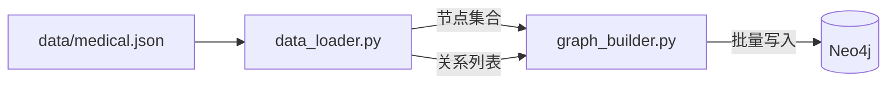

# knowledge_graph — 医疗知识图谱构建

## 概述

`knowledge_graph` 模块负责将 `data/medical.json` 中的医疗数据导入 Neo4j 图数据库，构建以**疾病为中心**的医疗知识图谱。

数据来源于从医药网站采集的约 **8,800 条**疾病记录。

---

## 图谱规模

| 指标 | 规模 |
|------|------|
| 节点总数 | 约 **4.4 万** |
| 关系总数 | 约 **30 万** |
| 节点类型 | **7 类**（Disease、Symptom、Drug、Food、Check、Department、Producer） |
| 关系类型 | **11 类**（症状、并发症、用药、饮食、检查、科室等） |

---

## 图模型（Schema）

### 节点标签

| 标签 | 说明 | 示例 |
|------|------|------|
| `Disease` | 疾病（带 14 个属性） | 糖尿病、高血压 |
| `Symptom` | 症状 | 头痛、多饮、多尿 |
| `Drug` | 药品 | 二甲双胍、胰岛素 |
| `Food` | 食物 | 苦瓜、粗粮 |
| `Check` | 检查项 | 血糖检测、糖耐量试验 |
| `Department` | 科室 | 内分泌科、心内科 |
| `Producer` | 药品生产商 | 诺和诺德 |

### 关系类型

| 关系 | 方向 | 说明 |
|------|------|------|
| `has_symptom` | Disease → Symptom | 疾病的症状 |
| `acompany_with` | Disease → Disease | 并发症 |
| `common_drug` | Disease → Drug | 常用药品 |
| `recommand_drug` | Disease → Drug | 推荐药品 |
| `do_eat` | Disease → Food | 宜吃食物 |
| `no_eat` | Disease → Food | 忌口食物 |
| `recommand_eat` | Disease → Food | 推荐食谱 |
| `need_check` | Disease → Check | 检查项目 |
| `belongs_to` | Disease → Department | 所属科室 |
| `drugs_of` | Producer → Drug | 生产药品 |
| `dept_belongs_to` | Department → Department | 上级科室 |

### Disease 节点属性

```
name, desc, cause, prevent, cure_way, cure_lasttime,
cured_prob, easy_get, cost_money, get_prob, get_way,
symptom, symptom_acompany, complication
```

---

## 目录结构

```
knowledge_graph/
├── config.py         # 图谱 Schema 定义（节点/关系/属性映射）
├── data_loader.py    # 从 JSONL 文件加载结构化医疗数据
├── graph_builder.py  # Neo4j 批量写入（参数化 Cypher + UNWIND）
└── main.py           # CLI 构建入口
```

---

## 构建流程



### 第一步：创建节点

```python
# 疾病节点（带 14 个属性）
builder.create_disease_nodes(disease_infos)

# 其他节点（Symptom/Drug/Food 等）
for label in ["Drug", "Food", "Check", "Department", "Producer", "Symptom"]:
    builder.create_simple_nodes(label, nodes[label])
```

### 第二步：创建关系

按以下顺序创建 11 种关系类型（UNWIND 批量插入）：

```
has_symptom → acompany_with → belongs_to → dept_belongs_to
→ common_drug → recommand_drug → do_eat → no_eat
→ recommand_eat → need_check → drugs_of
```

---

## 构建索引

模块自动创建以下索引以加速查询：

```cypher
CREATE INDEX disease_name IF NOT EXISTS FOR (n:Disease) ON (n.name)
CREATE INDEX symptom_name IF NOT EXISTS FOR (n:Symptom) ON (n.name)
CREATE INDEX drug_name    IF NOT EXISTS FOR (n:Drug)    ON (n.name)
CREATE INDEX food_name    IF NOT EXISTS FOR (n:Food)    ON (n.name)
CREATE INDEX check_name   IF NOT EXISTS FOR (n:Check)   ON (n.name)
```

---

## 使用命令

```bash
# 基础导入（依赖 Neo4j 已启动）
python -m knowledge_graph.main

# 清空旧数据后重新导入
python -m knowledge_graph.main --clear

# 分步构建（调试用）
python -m knowledge_graph.main --step nodes    # 只创建节点
python -m knowledge_graph.main --step rels     # 只创建关系

# 指定数据文件和远程 Neo4j
python -m knowledge_graph.main \
  --data ../data/medical.json \
  --uri bolt://192.168.1.10:7687 \
  --clear
```

### 命令行参数

| 参数 | 默认值 | 说明 |
|------|--------|------|
| `--data` | `data/medical.json` | 数据文件路径 |
| `--uri` | 来自 `settings.py` | Neo4j 连接地址 |
| `--user` | `neo4j` | Neo4j 用户名 |
| `--password` | `neo4j` | Neo4j 密码 |
| `--clear` | `False` | 构建前清空旧数据 |
| `--step` | 无（全量） | `nodes` 或 `rels` 分步构建 |

---

## 数据来源

`data/medical.json`（45 MB）包含约 8,800 条疾病记录，由 `data_spider/` 从医药网站采集。数据已固化，无需重新爬取。

详见 [data_spider/README.md](../data_spider/README.md)。
