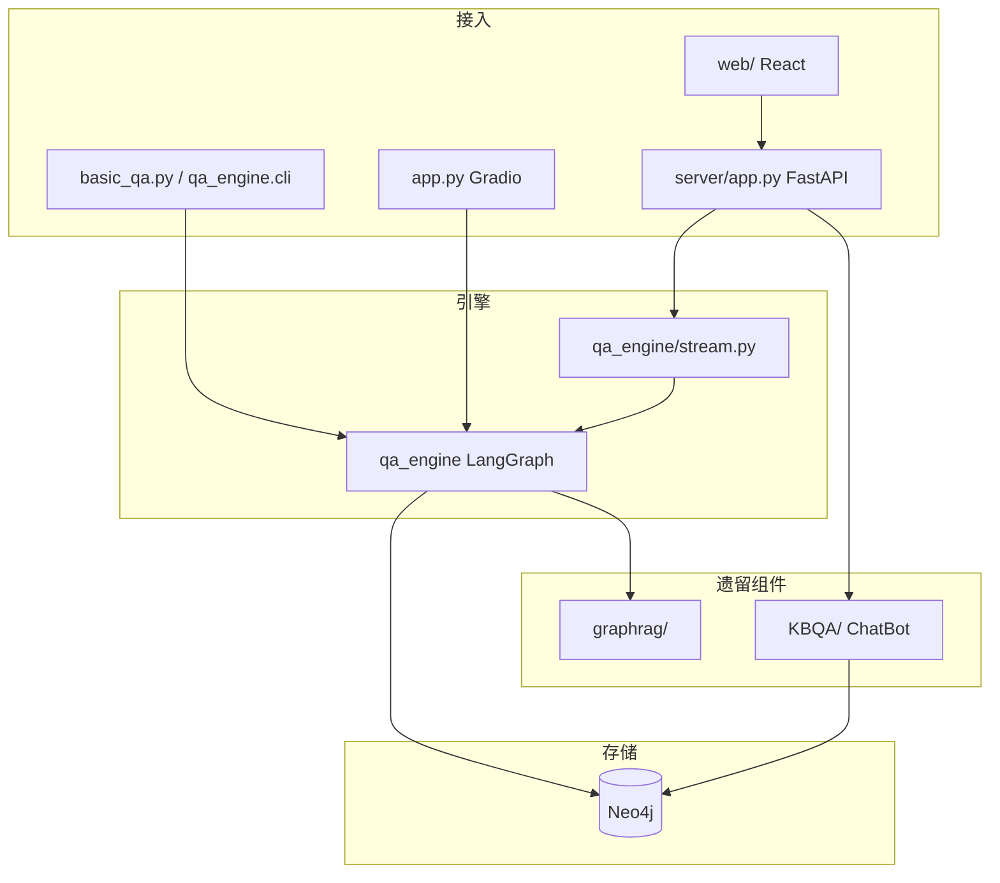

# 架构演进说明

> **⚠️ 已归档** — 本文档为历史参考，部分内容可能已过时。当前架构见 `docs/02_ARCHITECTURE.md`。

本文档记录医疗知识图谱智能问答系统从早期版本到当前 LangGraph 统一架构的演进过程。

---

## 1. 演进动机

### 早期架构的主要问题

| 问题 | 表现 |
|------|------|
| **双轨问答割裂** | `KBQA/chatbot.py`（模板 Cypher）与 `graphrag/graphrag_bot.py`（子图 RAG）各自维护入口，API 与前端需两套逻辑 |
| **路由靠人工切换** | 用户在前端选择「基础问答 / GraphRAG」，无法根据问句复杂度自动分流 |
| **流式协议不统一** | 旧 Bot 发 `retrieval` + `delta` + `done`；新引擎仅 `delta` / `done` / `error`，导致调试面板与图谱空白 |
| **可观测性弱** | 无统一 Trace；降级等级、路由路径分散在日志中 |
| **启动入口重复** | CLI、Gradio、FastAPI 各自拼装图，难以保证行为一致 |

### 演进目标

1. **单一问答引擎**：`qa_engine/` LangGraph 工作流承载全部分支  
2. **自动条件路由**：分析问题后自动选择 template / graphrag  
3. **统一流式契约**：SSE `done` 携带 `answer`、`debug`、`graph_data`、`mode`  
4. **保留旧代码**：`KBQA/`、`graphrag/` 不删除，供邻居查询、对照与回退  
5. **前端单面板**：`UnifiedChatPanel` + `normalizeDebug` 适配后端 debug 字段  

---

## 2. 重构内容清单

| 步骤 | 内容 | 原因 |
|------|------|------|
| 1 | 抽取 `qa_engine/state.py` 定义 `QAState` | 统一工作流状态，避免多份 TypedDict |
| 2 | 拆分 `qa_engine/nodes/`（analysis、route、template、graphrag、error） | 节点单一职责，便于测试与 LangSmith 节点级追踪 |
| 3 | `graph_builder.py` 组装 LangGraph + MemorySaver | 声明式边，替代脚本式 if-else 编排 |
| 4 | `stream.py` 基于 `astream_events` 输出 SSE 事件 | 支持 token 级流式与 done 聚合 debug |
| 5 | `basic_qa.py` 改为兼容入口 | 不破坏 `server/app.py`、`app.py` 既有 `import basic_qa` |
| 6 | `server/app.py` 问答走 `basic_qa.stream_qa` | 两个流式端点合并为同一生成器 |
| 7 | `web/` 合并 `UnifiedChatPanel`，`onDone` 更新侧栏 | 修复新引擎无 `retrieval` 事件导致的面板空白 |
| 8 | `app.py` Gradio 美化 + analysis_level / route 展示 | 演示与调试可视化 |
| 9 | `.env` + LangSmith 配置 | 可选链路追踪 |
| 10 | 文档体系 `docs/` | 项目文档规范化 |

---

## 3. 重构前后对比

| 维度 | 重构前 | 重构后 |
|------|--------|--------|
| **架构** | KBQA Bot + GraphRAG Bot 双实例 | `qa_engine` 单 LangGraph 工作流 |
| **降级** | 主要在 KBQA 分类器 | `analyze_with_fallback` 节点三级降级 |
| **路由** | 前端/接口手动选模式 | `route_question` + `select_route` 条件边 |
| **流式** | `retrieval` 提前推 debug | `done` 一次性推 debug + graph_data |
| **监控** | 日志为主 | 可选 LangSmith + 前端调试面板 |
| **前端** | ChatPanel + GraphRAGChatPanel 双面板 | UnifiedChatPanel + 按 `mode` 切换调试组件 |
| **API** | `/api/chat` 与 `/api/graphrag/chat` 逻辑重复 | 流式统一 `/api/chat/stream`（graphrag 端点保留兼容） |

---

## 4. 当前系统架构

**说明**：问答主路径走 `qa_engine`；`ChatBot` 仅用于 `/api/graph/neighbors` 与健康检查中的 Neo4j 连通性验证。

---

## 5. 技术决策记录（ADR 摘要）

### 5.1 为什么用 LangGraph 展开节点，而不是继续操控旧 Bot？

- 旧 `ChatBot.chat_stream()` 将检索、生成耦合在一个类中，难以插入「分析 → 路由 → 分支」中间态。  
- LangGraph 的 **条件边** 与 **检查点** 与「三级降级 + 双路径」天然匹配。  
- `astream_events` 可统一产出前端所需的 `delta` / `done`，无需维护两套 SSE 协议。

### 5.2 为什么保留 KBQA/、graphrag/ 旧代码？

- **邻居查询**、历史测试、对照实验仍依赖 `KBQA.chatbot.ChatBot`。  
- GraphRAG 子模块（实体抽取、子图检索）已被 `qa_engine/nodes/graphrag_path.py` 复用逻辑，保留原包避免破坏导入路径。  
- 符合「不删旧文件、最小风险迁移」约束。

### 5.3 为什么 `basic_qa.py` 不删除？

- `server/app.py`、`app.py`、集成测试大量使用 `import basic_qa`。  
- 作为 **稳定兼容层**，内部仅 re-export `qa_engine`，对外 API 不变。

### 5.4 为什么前端在 `onDone` 而不是 `onRetrieval` 更新侧栏？

- `qa_engine/stream.py` 的 `stream_qa` **不发送** `retrieval` 事件。  
- 所有 debug / graph_data 在 `done` 中返回；`normalizeDebug` 负责 `analysis_level` → `level` 等字段映射。

---

## 6. 已实现功能

- [x] LangGraph 统一工作流（模板 + GraphRAG）  
- [x] 三级降级语义分析  
- [x] 条件路由（template / graphrag）  
- [x] 模板路径无结果自动回退：当模板查询无结果时，自动切换到 GraphRAG 路径用 LLM 兜底  
- [x] CLI 同步 / 流式模式  
- [x] FastAPI SSE 流式 + 图谱邻居 API  
- [x] React 统一聊天、调试面板、力导向图谱  
- [x] Gradio 演示与 debug 展示（analysis_level、route）  
- [x] LangSmith 可选追踪  
- [x] `render_graph_diagram()` 工作流图导出  

---

## 7. 最终状态说明（v1.0.0 发布就绪）

以下原「待优化」项已在当前版本完成：

| 项 | 状态 |
|----|------|
| 非流式 API 的 graph_data | ✅ `/api/chat` 通过 `collect_stream_result` 与流式 `done` 对齐 |
| 模板路径图谱可视化 | ✅ `template_path.execute_query` 从 `raw_results` 构建 `graph_data` |
| requirements.txt | ✅ 锁定 LangChain 1.0 生态依赖版本 |
| 多轮对话 | ✅ MemorySaver + `session_id` / `chat_history`（CLI、Gradio、Web、API） |
| 模板无结果自动回退 | ✅ `select_query_outcome` 从 T3 条件跳转 G1，模板无结果时 GraphRAG 兜底 |
| LLM 最终兜底 | ✅ 当所有路径均失败时，调用 LLM 直接回答并附带免责声明 |
| Cypher 生成失败回退 | ✅ `generate_cypher` 失败不再设 `error`，改为 `template_no_result=True`，自动回退 GraphRAG/LLM |
| 实体归一化失败回退 | ✅ `normalize_entities` 失败改为 `template_no_result=True`，模板路径任何失败都先尝试 GraphRAG |
| 6 模式路由标签 | ✅ 前端 Badge 区分 6 种流转路径（template/graphrag/template_to_graphrag/llm_fallback/graphrag_to_llm/template_to_graphrag_to_llm） |
| 可恢复错误兜底 | ✅ `error_handler` 区分硬错误（LLM/Neo4j/Cypher）与可恢复错误，后者仍尝试 LLM 回答 |
| 工作流可视化同步 | ✅ 更新 `workflow.mmd` 含回退边，PNG/Mermaid/HTML 三格式一致 |
| 工作流 PNG | ✅ `scripts/generate_diagrams.py` → `docs/assets/workflow.png` |

**后续可增强（非阻塞发布）：**

- 扩展节点级单元测试覆盖率
- Gradio 全流式生成 + 更细粒度停止
- CI 自动生成架构图

---

## 相关文档

- [ARCHITECTURE.md](./ARCHITECTURE.md) — 分层与 API 详解  
- [QUICK_START.md](./QUICK_START.md) — 安装与排错  
